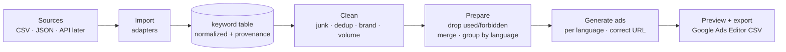

# Site.pro — Marketing Automation (Keyword → Google Ads)

A dockerized Yii2 + PostgreSQL platform that ingests keyword data from several sources
(Google Ads, Search Console, Ahrefs organic, and competitor paid keywords), cleans it,
prepares Google Ads campaigns grouped by language, and exports a **Google Ads Editor**
import file. Built with AI-assisted coding (#vibecoding).

> **Status:** work in progress. See [`docs/WORKLOG.md`](docs/WORKLOG.md) for what's done and
> what's next.
>
> **Live demo:** https://sitepro.dm312sv.online

## Quick start

```bash
docker compose up --build -d      # → http://127.0.0.1:8100
```

Admin login: `admin` / `admin`. Stop with `docker compose down` (add `-v` to reset data).

## What it does



Pipeline (matches the assignment):

1. **Import** keyword sources — CSV / JSON now, external API later, behind a common adapter.
2. **Admin area** — every keyword and every pipeline stage is visible.
3. **Clean** — remove junk, deduplicate, drop brand terms, filter by search volume.
4. **Prepare for Google Ads** — drop already-used and forbidden keywords, merge duplicates,
   group by language.
5. **Generate ads & export** — responsive search ads in each keyword's language pointing at
   the correct localized URL, plus a Google Ads Editor import file and an on-screen preview.

Every keyword carries **why** it was dropped, so the admin funnel explains each decision
rather than being a black box.

## Data

Real search metrics (monthly volume, CPC, competition) come from **Google Ads Keyword
Planner**. Private, account-specific exports we cannot access (a live Ads keyword list,
Search Console queries, an Ahrefs subscription) are represented by **clearly-labeled
sample files** with realistic structure. Real vs sample is always marked — see
[`docs/DATA.md`](docs/DATA.md).

## Stack

- **Yii2** basic 2.0.55, **PHP 8.4** — thin controllers, logic in a service layer
- **PostgreSQL 16**
- **Docker Compose** — `db` / `app` (php-fpm) / `web` (nginx), one command

## Project layout

```
backend/            Yii2 application (config, controllers, models, services, views, migrations)
docker/             nginx config
docker-compose.yml  full stack (web on 127.0.0.1:8100)
docs/               PLAN · DATA · API · WORKLOG · brief/TASK
```

## Documentation

- [`docs/PLAN.md`](docs/PLAN.md) — architecture, plan, and decisions
- [`docs/DATA.md`](docs/DATA.md) — data sources, provenance, and the unified schema
- [`docs/API.md`](docs/API.md) — import / export contracts
- [`docs/WORKLOG.md`](docs/WORKLOG.md) — work journal and current status
- [`docs/brief/TASK.md`](docs/brief/TASK.md) — the original assignment
