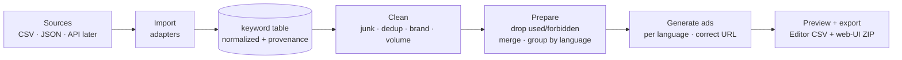

# Site.pro — Marketing Automation (Keyword → Google Ads)

> 🇷🇺 Russian mirror of the docs: [`docs/ru/`](docs/ru/README.md) (English is the source of truth).

A dockerized Yii2 + PostgreSQL platform that ingests keyword data from several sources
(Google Ads, Search Console, Ahrefs organic, and competitor paid keywords), cleans it,
prepares Google Ads campaigns grouped by language, and exports them for **both** Google Ads
import paths — a **Google Ads Editor** (desktop) CSV and a **web-UI bulk-upload** ZIP. Built
with AI-assisted coding (#vibecoding).

> **Status:** work in progress. See [`docs/WORKLOG.md`](docs/WORKLOG.md) for what's done and
> what's next.
>
> **Live demo:** https://sitepro.dm312sv.online

## Quick start

```bash
cp .env.example .env               # config: admin login, DB, cookie key (works as-is for local)
docker compose up --build -d       # → http://127.0.0.1:8100

# load the four sample keyword files (or upload them in the admin area)
docker compose exec app php yii import/samples

# run the pipeline (or use the admin pages: Cleaning → Prepare → Ads)
docker compose exec app php yii clean/run        # junk · dedup · brand · volume
docker compose exec app php yii prepare/run      # drop used/forbidden · merge · group by language
docker compose exec app php yii adgen/run        # one responsive search ad per ad group
```

Admin login comes from `.env` (`ADMIN_USERNAME` / `ADMIN_PASSWORD`; defaults `admin` / `admin`).
Sign in, then **Import & data** → upload a CSV/JSON, and **Keywords** → browse everything
imported. Stop with `docker compose down` (add `-v` to reset data).

## Test it (for reviewers)

Use the **live demo** (already populated, no setup) or a local run — the flow is the same.
Everything the assignment asks to test — **upload, admin area, preview, export** — is on these pages.

1. **Sign in** with the `.env` credentials (live demo credentials are provided with the submission).
2. **Import & data** → **Clear all data** for a clean start, then upload each source file from
   [`sample-data/`](sample-data/) (or its JSON twin in [`sample-data/json/`](sample-data/json/)),
   picking the matching **Source** each time. → **378** keywords imported.
   > Uploading *adds* a batch — it doesn't replace. For a clean re-run, hit **Clear all data** first
   > (otherwise you'll see duplicated counts). Console shortcut for all four at once: `yii import/samples`.
3. **Cleaning** → **Run** — junk · dedup · brand · volume, with a funnel explaining every drop. → **154** kept.
4. **Prepare** → **Run** — drop already-used/forbidden · merge · group by language + theme.
   → **107** prepared in **19** ad groups across **6** languages.
5. **Ads** → **Run** — one responsive search ad per ad group, in its language. → **19** ads.
6. **Export** → preview + two downloads:
   - **Editor CSV** — a single file for the **Google Ads Editor** desktop app (Account → Import → From file). → **127** rows.
   - **Bulk-upload ZIP** — one CSV per entity for the **web UI** (Tools → Bulk actions → Uploads); the bundled README gives the order.

Sanity-check numbers end to end: **378 → 154 → 107 → 19 ad groups / 19 ads → Editor CSV 127 rows · bulk ZIP (4 sheets)**.

## What it does



Pipeline (matches the assignment):

1. **Import** keyword sources — CSV / JSON now, external API later, behind a common adapter.
2. **Admin area** — every keyword and every pipeline stage is visible.
3. **Clean** — remove junk, deduplicate, drop brand terms, filter by search volume.
4. **Prepare for Google Ads** — drop already-used and forbidden keywords, merge duplicates,
   group by language.
5. **Generate ads & export** — responsive search ads in each keyword's language pointing at
   the correct localized URL, plus an on-screen preview and two import artifacts: a Google Ads
   Editor (desktop) CSV and a web-UI bulk-upload ZIP (one sheet per entity).

Every keyword carries **why** it was dropped, so the admin funnel explains each decision
rather than being a black box.

## Data

Real search metrics (monthly volume, CPC, competition) come from **Google Ads Keyword
Planner**. Private, account-specific exports we cannot access (a live Ads keyword list,
Search Console queries, an Ahrefs subscription) are represented by **clearly-labeled
sample files** with realistic structure. Real vs sample is always marked — see
[`docs/DATA.md`](docs/DATA.md).

## Stack

- **Yii2** basic 2.0.55, **PHP 8.4** — thin controllers, logic in a service layer
- **PostgreSQL 16**
- **Docker Compose** — `db` / `app` (php-fpm) / `web` (nginx), one command

## Project layout

```
backend/            Yii2 application (config, controllers, models, services, views, migrations)
docker/             nginx config
docker-compose.yml  full stack (web on 127.0.0.1:8100)
docs/               PLAN · DATA · API · WORKLOG · brief/TASK
```

## Documentation

- [`docs/PLAN.md`](docs/PLAN.md) — architecture, plan, and decisions
- [`docs/DATA.md`](docs/DATA.md) — data sources, provenance, and the unified schema
- [`docs/API.md`](docs/API.md) — import / export contracts
- [`docs/WORKLOG.md`](docs/WORKLOG.md) — work journal and current status
- [`docs/brief/TASK.md`](docs/brief/TASK.md) — the original assignment
