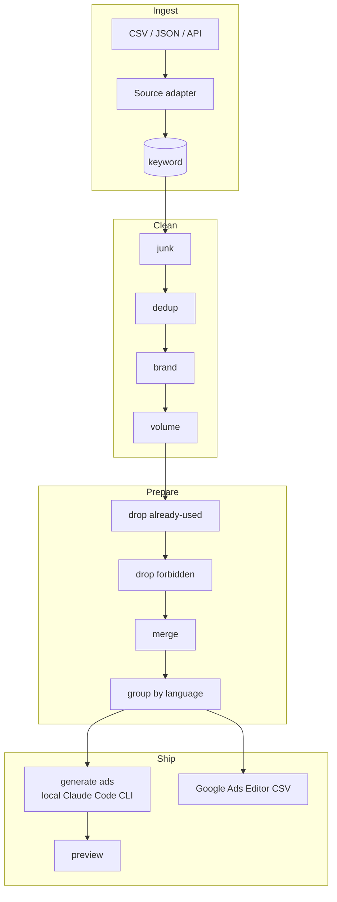

# Architecture & plan

> How the platform is built and why. Status lives in [`WORKLOG.md`](WORKLOG.md); data
> details in [`DATA.md`](DATA.md); the original task in [`brief/TASK.md`](brief/TASK.md).

## Goal

Take keyword data from four sources, turn it into clean, ready-to-launch Google Ads
campaigns grouped by language, and produce a Google Ads Editor import file — with an admin
area where every step is visible and auditable.

## Architecture

Thin controllers delegate to a **service layer**; ActiveRecord models hold data. Every
source is normalized into one `keyword` table so the rest of the pipeline is source-agnostic.

Components:

- **Import adapters** — `CsvAdapter` / `JsonAdapter` now; an `ApiAdapter` (Search Console /
  Google Ads / Ahrefs) is a documented seam for the assignment's "later we will use API".
  Each adapter maps its source's columns onto the unified `keyword` record.
- **Cleaning pipeline** — each rule (junk, dedup, brand, volume) is a small single-purpose
  class run in sequence. A rule doesn't delete rows; it flags them and records a
  `drop_reason`, so the admin funnel can explain every decision.
- **Preparation** — drop already-used and forbidden keywords, merge duplicates (normalize:
  lowercase, trim, collapse whitespace, sort tokens; aggregate volume; keep a canonical
  term), then group by language.
- **Ad generation** — a service asks a local Claude Code CLI on the host to write a
  responsive search ad for each language group (in that language, with the correct target
  URL). Output is validated as untrusted input (headline/description length limits, language,
  required URL) and cached; a template fallback covers the CLI being unavailable. No
  per-call paid API.
- **Export** — a Google Ads Editor-compatible CSV (ad-group keywords + responsive search ads).
- **Funnel dashboard** — counts at each stage (imported → cleaned → prepared → ad-ready) and
  the reason keywords dropped out.

## Data model (draft)

| Table | Purpose |
|-------|---------|
| `import_batch` | one upload: source, filename, format, row counts, timestamp |
| `keyword` | the central record — raw + normalized term, source, language, geo, volume, CPC, competition, competitor domain, source URL, stage flags, `drop_reason`, `dedup_group_id` |
| `brand_term`, `forbidden_term` | editable lists used by the brand / forbidden rules |
| `rule_config` | thresholds (e.g. min volume) editable in the admin area |
| `ad_group` | language, theme, final URL |
| `generated_ad` | headlines/descriptions (JSON), paths, final URL, generated_by (claude/template) |
| `export_file` | produced export artifacts |

Full field list and source→field mapping: [`DATA.md`](DATA.md).

## Ideas beyond the assignment

- **Competitor gap analysis** — competitor paid keywords absent from our own sources are
  flagged as opportunities (the reason to pull competitor data at all).
- **Net-new diff** — surface only new keywords (minus already-used), not the whole set.
- **Editable rules** — volume threshold, brand list, forbidden list are managed in the admin
  area, not hard-coded.
- **Per-keyword drop reason** — the funnel is auditable end to end.

## Cleaning defaults (configurable)

- **Junk:** empty / single char / digits-only / symbols-only / excessive length / stopword-only.
- **Brand:** `site.pro`, `sitepro`, plus competitor brands (editable list).
- **Volume:** drop `avg_monthly_searches` < 50/mo (threshold editable).
- **Dedup / merge:** normalize the term, merge, aggregate volume, keep a canonical term.
- **Language:** a `language`/`market` column in the data, with language detection as fallback.
- **Target URL:** a language → landing-page map (e.g. `site.pro/de`); a convention plus admin
  override when canonical URLs aren't provided.

## Decisions

Recorded as context → decision → consequence.

1. **PostgreSQL 16.** Consistent with the rest of the toolchain and good JSON support for
   ad payloads. → Yii2 configured for `pgsql`; Docker runs `postgres:16-alpine`.
2. **Docker topology `db` / `app` (php-fpm) / `web` (nginx).** One-command reviewer setup.
   → `docker compose up --build` → :8100; images are self-contained.
3. **Ad copy generated by a local Claude Code CLI on the host.** No per-call paid API and no
   API keys shipped in the app. → Generation runs as a cached job with a template fallback.
4. **Export as Google Ads Editor CSV.** It's the practical answer to "file to import" and
   loads directly into Google Ads. → `ExportService` emits keywords + responsive search ads.
5. **Real metrics from Google Ads Keyword Planner, fetched at build time.** Gives real
   search volume / CPC / competition without putting any credentials on the public host. →
   Metrics are baked into the input files; the deployed app only imports files.
6. **Private account exports are simulated as clearly-labeled samples.** We don't have
   Site.pro's live Ads account, Search Console, or Ahrefs subscription. → Those sources ship
   as labeled sample files; the `ApiAdapter` seam replaces them with real feeds when access
   is granted. See [`DATA.md`](DATA.md).
7. **Dev volume layout.** Host-mounted source for live edits; container-managed volumes for
   `vendor` / `runtime` / `web`. → Fast iteration locally, and a fresh clone runs without any
   host state.

## Build stages

See [`WORKLOG.md`](WORKLOG.md) for the stage table and live status. In short: spike ✅ →
skeleton ✅ → import & model (current) → cleaning → prepare → ad generation → export → deploy.

## Open questions

- Canonical Site.pro landing URLs per language (or an agreed convention).
- Whether Site.pro will grant real access to their Search Console / Ads / Ahrefs (turns
  samples into real feeds).
- Which languages / markets to showcase in the preview.
