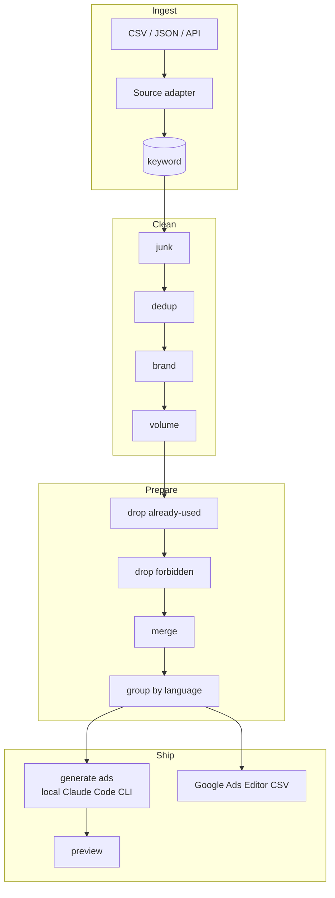

# Architecture & plan

> How the platform is built and why. Status lives in [`WORKLOG.md`](WORKLOG.md); data
> details in [`DATA.md`](DATA.md); the original task in [`brief/TASK.md`](brief/TASK.md).

## Goal

Take keyword data from four sources, turn it into clean, ready-to-launch Google Ads
campaigns grouped by language, and produce a Google Ads Editor import file — with an admin
area where every step is visible and auditable.

## Architecture

Thin controllers delegate to a **service layer**; ActiveRecord models hold data. Every
source is normalized into one `keyword` table so the rest of the pipeline is source-agnostic.

Components:

- **Import adapters** — `CsvAdapter` / `JsonAdapter` now; an `ApiAdapter` (Search Console /
  Google Ads / Ahrefs) is a documented seam for the assignment's "later we will use API".
  Each adapter maps its source's columns onto the unified `keyword` record.
- **Cleaning pipeline** — each rule (junk, dedup, brand, volume) is a small single-purpose
  class run in sequence. A rule doesn't delete rows; it flags them and records a
  `drop_reason`, so the admin funnel can explain every decision.
- **Preparation** — drop already-used and forbidden keywords, merge duplicates (normalize:
  lowercase, trim, collapse whitespace, sort tokens; aggregate volume; keep a canonical
  term), then group by language.
- **Ad generation** — a service asks a local Claude Code CLI on the host to write a
  responsive search ad for each language group (in that language, with the correct target
  URL). Output is validated as untrusted input (headline/description length limits, language,
  required URL) and cached; a template fallback covers the CLI being unavailable. No
  per-call paid API.
- **Export** — a Google Ads Editor-compatible CSV (ad-group keywords + responsive search ads).
- **Funnel dashboard** — counts at each stage (imported → cleaned → prepared → ad-ready) and
  the reason keywords dropped out.

## Data model (draft)

| Table | Purpose |
|-------|---------|
| `import_batch` | one upload: source, filename, format, row counts, timestamp |
| `keyword` | the central record — raw + normalized term, source, language, geo, volume, CPC, competition, competitor domain, source URL, stage flags, `drop_reason`, `dedup_group_id` |
| `brand_term`, `forbidden_term` | editable lists used by the brand / forbidden rules |
| `rule_config` | thresholds (e.g. min volume) editable in the admin area |
| `ad_group` | one language+theme bucket: language, theme (+ `theme_key`), campaign name, final URL, keyword count — fully derived from `keyword`, rebuilt each preparation run |
| `generated_ad` | headlines/descriptions (JSON), paths, final URL, generated_by (claude/template) |
| `export_file` | produced export artifacts |

Full field list and source→field mapping: [`DATA.md`](DATA.md).

## Ideas beyond the assignment

- **Competitor gap analysis** — competitor paid keywords absent from our own sources are
  flagged as opportunities (the reason to pull competitor data at all).
- **Net-new diff** — surface only new keywords (minus already-used), not the whole set.
- **Editable rules** — volume threshold, brand list, forbidden list are managed in the admin
  area, not hard-coded.
- **Per-keyword drop reason** — the funnel is auditable end to end.

## Cleaning defaults (configurable)

- **Junk:** empty / single char / digits-only / symbols-only / excessive length (editable
  `max_term_length`, floored at 1) / stopword-only / keyboard-mash gibberish (a vowel-less token
  of 5+ letters — deliberately narrow so real multilingual words aren't touched).
- **Brand:** `site.pro`, `sitepro`, plus competitor brands (editable list); matched at word
  boundaries so a brand never matches inside a longer word.
- **Volume:** drop `avg_monthly_searches` < 50/mo (threshold editable); rows whose source gave
  no volume are kept, not dropped (unknown ≠ low).
- **Dedup / merge:** normalize the term, keep a canonical (highest volume, ties → lowest id).
  Stage 4 only marks duplicates; aggregating their volume into the canonical is stage 5.
- **Language:** a `language`/`market` column in the data, with language detection as fallback.
- **Target URL:** a language → landing-page map (e.g. `site.pro/de`); a convention plus admin
  override when canonical URLs aren't provided.

## Decisions

Recorded as context → decision → consequence.

1. **PostgreSQL 16.** Consistent with the rest of the toolchain and good JSON support for
   ad payloads. → Yii2 configured for `pgsql`; Docker runs `postgres:16-alpine`.
2. **Docker topology `db` / `app` (php-fpm) / `web` (nginx).** One-command reviewer setup.
   → `docker compose up --build` → :8100; images are self-contained.
3. **Ad copy generated with a local Claude Code CLI, offline.** No per-call paid API and no
   API keys shipped in the app. → For the public demo, ad copy is generated ahead of time
   (locally) and stored, so the deployed host runs no generation and holds no AI credentials;
   a template fallback covers gaps. If a reviewer wants to run generation themselves, we add
   the API adapter or share the local generation flow on request.
4. **Export as Google Ads Editor CSV.** It's the practical answer to "file to import" and
   loads directly into Google Ads. → `ExportService` emits keywords + responsive search ads.
5. **Real metrics from Google Ads Keyword Planner, fetched at build time.** Gives real
   search volume / CPC / competition without putting any credentials on the public host. →
   Metrics are baked into the input files; the deployed app only imports files.
6. **Private account exports are simulated as clearly-labeled samples.** We don't have
   Site.pro's live Ads account, Search Console, or Ahrefs subscription. → Those sources ship
   as labeled sample files and stay that way (finalized in decision 14 — access won't be
   granted); the `ApiAdapter` seam is the documented extension point, kept to satisfy the
   assignment's "later API" rather than a feed we expect to receive. See [`DATA.md`](DATA.md).
7. **Dev volume layout.** Host-mounted source for live edits; container-managed volumes for
   `vendor` / `runtime` / `web`. → Fast iteration locally, and a fresh clone runs without any
   host state.
8. **All config — including admin credentials — comes from `.env`.** Nothing sensitive is
   hard-coded in PHP. → `models/User.php` builds a single admin identity from `ADMIN_USERNAME` /
   `ADMIN_PASSWORD`; `docker-compose.yml` uses `${VAR:-default}` substitution; `.env.example`
   documents every variable and `.env` is gitignored.
9. **Keep each source's original row in `raw_data` (JSON).** The unified columns can't hold
   every source-specific field (Ahrefs `kd`/`traffic`, Search Console `ctr`). → A `raw_data`
   text column preserves the full row for audit without widening the schema.
10. **Single `cpc`, not a low/high range.** The generated inputs (and typical exports) carry
    one CPC value per keyword. → The record stores a single `cpc`; a range can be added later
    without breaking anything.
11. **Language detection is a fallback, not the primary path.** Three of four sources carry a
    language column and are trusted; only Search Console lacks one. → A small marker-word +
    diacritic `LanguageDetector` fills the gap and defaults to English when nothing is
    distinctive. It is deliberately simple and documented as such.
12. **Verified the language → landing-URL map against the live site.** de/es/fr/it have
    dedicated localized pages; `en` and `pt` resolve to real targets — notably Portuguese has
    no `/pt` page and the live site serves it at `/pt-br/`. → The map lives in `params.php`
    and is admin-overridable for stage 6.
13. **Blank terms are skipped at import; character-junk is kept for the cleaning stage.** A
    whitespace-only term is not a keyword, so it's skipped (counted in `rows_skipped`).
    Junk that has actual characters (digits-only, single char, symbols) imports normally and
    gets flagged with a `drop_reason` in stage 4, so the funnel can explain it.
14. **No access to Site.pro's private accounts — those sources stay samples permanently.** We
    will not get Site.pro's live Ads keyword list, Search Console, or Ahrefs subscription, and
    there is no one to grant it. → Those three sources remain clearly-labeled sample files for
    good; we never present them as real. The real Keyword Planner metrics (volume / CPC /
    competition) stay real and labeled as such — that distinction doesn't change. The
    `ApiAdapter` seam is kept solely to satisfy the assignment's "later we will use API": a
    demonstrated extension point, **not** a feed we are waiting on. Supersedes the optimistic
    "when access is granted" framing in decision 6.
15. **Target URL per language: verified localized Site.pro homepages by default, overridable
    per language in the admin area.** Site.pro won't provide exact per-keyword landing pages,
    and there is no one to confirm canonical deep links with. → The default target for each
    language group is the verified localized homepage (`en` → `/`, `de`/`es`/`fr`/`it` →
    `/xx/`, `pt` → `/pt-br/`; the map from decision 12), and the admin area can override the
    URL per language. We don't invent canonical URLs we can't confirm; the homepage is the
    honest, working default.
16. **Cleaning flags, never deletes; the funnel is a sequential pipeline.** Auditability is the
    point — a reviewer must see why each keyword was dropped. → Each rule sets a boolean flag and
    a `drop_reason`; junk → dedup → brand → volume run in order and a row dropped by one rule is
    not seen by the next, so every dropped row carries exactly one reason and the per-stage counts
    are disjoint (the dashboard's remaining-count subtraction is exact).
17. **Dedup across the whole dataset; link only surviving canonicals.** The same term arriving
    from Google Ads and from Ahrefs is one keyword. → Group by normalized term over all rows;
    the canonical survivor is the highest-volume row (ties → lowest id, deterministic). The group
    link (`dedup_group_id`) is written only when the canonical actually survives cleaning, so no
    live row ever references a dropped canonical. Merging the duplicates' metrics is stage 5.
18. **A missing volume is kept, not dropped.** Some sources (Search Console; parts of Ahrefs)
    report no search volume. → The volume rule drops a keyword only when it *has* a volume below
    the threshold; unknown volume survives (unknown ≠ low), to be resolved when richer data lands.
19. **Junk gibberish and brand matching are deliberately conservative.** The data spans six
    languages. → The gibberish check only flags a vowel-less token of 5+ letters (catches
    keyboard mash like `zxcvbnm` without touching real words, whose consonant clusters still carry
    vowels); brand terms match on word boundaries (so "wix" hits "wix.com" but not "wixel" or the
    Spanish "tildar"). Both err toward keeping a real keyword over a false drop.
20. **Cleaning is the head of the pipeline: a run is a pure function of the imported data and
    resets the whole downstream.** The earlier "scope cleaning to its own rows so a re-run never
    disturbs stage 5" design was wrong — dedup is *global*, so hiding the rows stage 5 had locked
    made cleaning's dedup pick different canonicals and resurrect duplicates, drifting the kept set
    (154 → 237 → …) and re-introducing duplicate keywords into the prepared set on every
    clean→prepare cycle. → `run()` now resets **every** keyword to `imported`, clears all cleaning
    *and* preparation flags, empties the derived `ad_group` table, then recomputes. Re-running
    cleaning deterministically yields the same result regardless of history and **invalidates
    stage 5 by design** (a changed cleaning rule must reconsider every row); the console/UI tell the
    operator to re-run preparation. Supersedes the scoped-reset design.

21. **"Already used" = the `google_ads` source.** The assignment says to drop keywords already used
    in Ads; that source *is* the account's live keyword list, so we need no extra list. → An exact
    normalized-term match against the google_ads terms flags a keyword as already-used, leaving a
    **net-new** prepared set (a google_ads keyword that survived cleaning flags itself — intended).
    A separate editable "already-used" list was considered and rejected as redundant.

22. **Merge keeps one true volume (the max), never a sum.** The same term from Google Ads and from
    Ahrefs is one search query with one real monthly volume. → Stage-4 dedup already collapses each
    duplicate group to its highest-volume canonical, so the prepared survivor carries the group's
    true (max) volume; stage 5 reports the consolidation and does not add volumes (which would
    triple-count a single query).

23. **Grouping: one campaign per language, themed ad groups via a frequency token clusterer.** The
    task says "group by language"; real campaigns also need ad groups. → `GroupingService` builds a
    campaign per language (target URL from the verified `languageUrlMap`, decision 15) and
    `ThemeClusterer` assigns each keyword to the ad group named after the highest-frequency
    meaningful token it contains (multilingual stopwords + bare numbers ignored; ties →
    alphabetical; single-keyword themes fold into `General`). It is a deliberately simple,
    deterministic **heuristic**, documented as such — a smarter clusterer (embeddings, an editable
    taxonomy) is a later refinement. The `ad_group` table is fully derived and rebuilt each run.

24. **The keyword grid's Kept/Dropped is pipeline-wide, not tied to one stage.** Once stage 5
    advances rows to `prepared` and flags others, "kept = stage is cleaned" would show stage-5
    drops as kept. → Kept = `drop_reason IS NULL AND stage <> imported` (still surviving,
    whichever stage), Dropped = has a `drop_reason` (any stage). The two are mutually exclusive and
    stay correct as later stages advance rows.

25. **Grouping preserves a later stage's `ad_ready` groups; ad groups advance as a whole.** A
    preparation re-run rebuilds the *prepared* campaigns and must not wipe campaigns whose ads a
    later stage already generated. → The rebuild unlinks only `prepared` rows and deletes only
    ad groups not referenced by an `ad_ready` row, on the assumption that stage 6 advances an ad
    group to `ad_ready` as a whole (its keywords move together). No `ad_ready` rows exist yet, so
    today this is an exact full rebuild; stage 6 will confirm the whole-group advancement model.

## Build stages

See [`WORKLOG.md`](WORKLOG.md) for the stage table and live status. In short: spike ✅ →
skeleton ✅ → import & model ✅ → cleaning ✅ → prepare ✅ → ad generation (next) → export → deploy.

## Open questions

- Stage 6 target-URL granularity: keep the per-language homepage default, or add per-ad-group
  (per-theme) landing overrides in the admin.
- Whether stage 6 advances an ad group to `ad_ready` as a whole (assumed in decision 25) or lets a
  group be partially generated.
