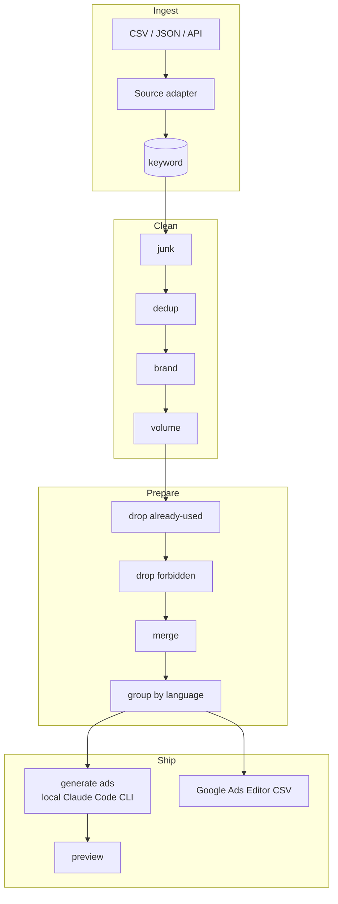

# Architecture & plan

> RU: перевод английского оригинала (PLAN.md). При расхождении английская версия — источник правды.

> Как устроена платформа и почему. Статус описан в [`WORKLOG.md`](WORKLOG.md); детали
> по данным — в [`DATA.md`](DATA.md); исходное задание — в [`brief/TASK.md`](../brief/TASK.md).

## Goal

Берём данные по ключевым словам из четырёх источников, превращаем их в чистые, готовые
к запуску рекламные кампании Google Ads, сгруппированные по языкам, и формируем файл
импорта для Google Ads Editor — с админ-областью, где каждый шаг виден и поддаётся аудиту.

## Architecture

Тонкие контроллеры делегируют работу **сервисному слою**; данные хранятся в моделях
ActiveRecord. Каждый источник нормализуется в единую таблицу `keyword`, поэтому остальной
конвейер не зависит от источника.

Компоненты:

- **Адаптеры импорта** — `CsvAdapter` / `JsonAdapter` сейчас; `ApiAdapter` (Search Console /
  Google Ads / Ahrefs) — задокументированная точка расширения под требование задания
  «позже будем использовать API». Каждый адаптер отображает колонки своего источника
  на унифицированную запись `keyword`.
- **Конвейер очистки** — каждое правило (junk, dedup, brand, volume) — это небольшой класс
  с одной ответственностью, выполняемый последовательно. Правило не удаляет строки; оно
  помечает их и записывает `drop_reason`, поэтому админская воронка может объяснить каждое
  решение.
- **Подготовка** — отбрасываем уже использованные и запрещённые ключевые слова, объединяем
  дубликаты (нормализация: нижний регистр, обрезка пробелов, схлопывание пробелов, сортировка
  токенов; агрегирование объёма; сохранение канонического термина), затем группируем по языку.
- **Генерация объявлений** — сервис просит локальный Claude Code CLI на хосте написать
  адаптивное поисковое объявление для каждой языковой группы (на этом языке, с корректным
  целевым URL). Результат валидируется как недоверенный ввод (ограничения длины заголовков/
  описаний, язык, обязательный URL) и кэшируется; шаблонный запасной вариант покрывает случай
  недоступности CLI. Никакого платного API на каждый вызов.
- **Экспорт** — два артефакта под два пути импорта Google Ads (решение 34): объединённый CSV
  для Google Ads Editor (десктоп) и ZIP массовой загрузки для веб-интерфейса (по одному CSV
  на сущность). Форматирование вынесено в единый `CsvWriter`.
- **Дашборд-воронка** — счётчики на каждом этапе (imported → cleaned → prepared → ad-ready) и
  причина, по которой ключевые слова отсеялись.

## Data model (draft)

| Table | Purpose |
|-------|---------|
| `import_batch` | одна загрузка: источник, имя файла, формат, счётчики строк, отметка времени |
| `keyword` | центральная запись — сырой + нормализованный термин, источник, язык, гео, объём, CPC, конкуренция, домен конкурента, URL источника, флаги этапов, `drop_reason`, `dedup_group_id` |
| `brand_term`, `forbidden_term` | редактируемые списки, используемые правилами brand / forbidden |
| `rule_config` | пороги (например, минимальный объём), редактируемые в админ-области |
| `ad_group` | одна корзина язык+тема: язык, тема (+ `theme_key`), имя кампании, финальный URL, число ключевых слов — полностью производна от `keyword`, пересобирается при каждом запуске подготовки |
| `generated_ad` | одно RSA на группу объявлений: заголовки/описания (JSON), пути, финальный URL, generated_by (stored/template), is_valid — полностью производна, пересобирается при каждом запуске, каскадно связана со своей группой объявлений |

Черновая таблица `export_file` была удалена: экспорт выводится по требованию, а не хранится
(решение 31).

Полный список полей и отображение источник→поле: [`DATA.md`](DATA.md).

## Ideas beyond the assignment

- **Анализ пробелов относительно конкурентов** — платные ключевые слова конкурентов,
  отсутствующие в наших собственных источниках, помечаются как возможности (ради этого
  вообще и подтягиваются данные конкурентов).
- **Diff чисто новых** — показываем только новые ключевые слова (за вычетом уже
  использованных), а не весь набор.
- **Редактируемые правила** — порог объёма, список брендов, список запрещённых управляются
  в админ-области, а не жёстко зашиты.
- **Причина отбраковки по каждому ключевому слову** — воронка поддаётся аудиту от начала
  до конца.

## Cleaning defaults (configurable)

- **Junk:** пустое / один символ / только цифры / только символы / чрезмерная длина
  (редактируемый `max_term_length`, минимум 1) / только стоп-слова / бессмысленный набор
  символов «клавиатурная каша» (токен без гласных из 5+ букв — намеренно узко, чтобы не
  задеть настоящие многоязычные слова).
- **Brand:** `site.pro`, `sitepro`, плюс бренды конкурентов (редактируемый список);
  сопоставление по границам слов, чтобы бренд никогда не срабатывал внутри более длинного
  слова.
- **Volume:** отбрасываем `avg_monthly_searches` < 50/мес (порог редактируемый); строки, у
  которых источник не дал объём, сохраняются, а не отбрасываются (неизвестно ≠ мало).
- **Dedup / merge:** нормализуем термин, сохраняем канонический (наибольший объём, при
  равенстве → наименьший id). Этап 4 только помечает дубликаты; агрегирование их объёма в
  канонический — это этап 5.
- **Language:** колонка `language`/`market` в данных, с определением языка как запасным
  вариантом.
- **Target URL:** отображение язык → посадочная страница (например, `site.pro/de`);
  соглашение плюс переопределение в админке, когда канонические URL не предоставлены.

## Decisions

Записаны в формате контекст → решение → следствие.

1. **PostgreSQL 16.** Согласуется с остальным набором инструментов и хорошо поддерживает
   JSON для полезной нагрузки объявлений. → Yii2 настроен на `pgsql`; в Docker работает
   `postgres:16-alpine`.
2. **Docker-топология `db` / `app` (php-fpm) / `web` (nginx).** Настройка для ревьюера
   одной командой. → `docker compose up --build` → :8100; образы самодостаточны.
3. **Текст объявлений генерируется локальным Claude Code CLI, офлайн.** Никакого платного
   API на каждый вызов и никаких API-ключей в приложении. → Для публичного демо текст
   объявлений генерируется заранее (локально) и сохраняется, поэтому развёрнутый хост
   ничего не генерирует и не хранит AI-учётные данные; шаблонный запасной вариант покрывает
   пробелы. Если ревьюер захочет запустить генерацию сам, мы добавляем API-адаптер или по
   запросу делимся локальным процессом генерации.
4. **Экспорт в формате Google Ads Editor CSV.** Это практичный ответ на «файл для импорта»,
   он загружается прямо в Google Ads. → `ExportService` выдаёт ключевые слова + адаптивные
   поисковые объявления.
5. **Реальные метрики из Google Ads Keyword Planner, выгруженные на этапе сборки.** Дают
   реальный объём поиска / CPC / конкуренцию, не размещая никаких учётных данных на публичном
   хосте. → Метрики впечатаны во входные файлы; развёрнутое приложение только импортирует
   файлы.
6. **Экспорты из приватных аккаунтов имитируются как чётко помеченные образцы.** У нас нет
   живого Ads-аккаунта Site.pro, Search Console или подписки Ahrefs. → Эти источники
   поставляются как помеченные файлы-образцы и остаются таковыми (закреплено в решении 14 —
   доступ не будет предоставлен); точка расширения `ApiAdapter` — задокументированный вариант
   расширения, оставленный ради требования задания «позже API», а не поток, который мы
   ожидаем получить. См. [`DATA.md`](DATA.md).
7. **Раскладка dev-томов.** Смонтированный с хоста исходный код для правок вживую; тома под
   управлением контейнера для `vendor` / `runtime` / `web`. → Быстрые итерации локально, и
   свежий клон запускается без какого-либо состояния хоста.
8. **Вся конфигурация — включая учётные данные администратора — берётся из `.env`.** Ничего
   чувствительного не зашито в PHP. → `models/User.php` строит единую личность администратора
   из `ADMIN_USERNAME` / `ADMIN_PASSWORD`; `docker-compose.yml` использует подстановку
   `${VAR:-default}`; `.env.example` документирует каждую переменную, а `.env` в gitignore.
9. **Сохраняем исходную строку каждого источника в `raw_data` (JSON).** Унифицированные
   колонки не могут вместить каждое специфичное для источника поле (Ahrefs `kd`/`traffic`,
   Search Console `ctr`). → Текстовая колонка `raw_data` сохраняет полную строку для аудита,
   не расширяя схему.
10. **Один `cpc`, а не диапазон low/high.** Сгенерированные входные данные (и типичные
    экспорты) несут одно значение CPC на ключевое слово. → Запись хранит один `cpc`;
    диапазон можно добавить позже, ничего не сломав.
11. **Определение языка — запасной путь, а не основной.** Три из четырёх источников несут
    колонку языка, и им доверяют; только у Search Console её нет. → Небольшой
    `LanguageDetector` на маркерных словах + диакритике заполняет пробел и по умолчанию
    выбирает английский, когда ничего отличительного нет. Он намеренно прост и так и
    задокументирован.
12. **Проверили отображение язык → посадочный URL по живому сайту.** У de/es/fr/it есть
    выделенные локализованные страницы; `en` и `pt` разрешаются в реальные цели — в частности,
    у португальского нет страницы `/pt`, и живой сайт отдаёт его по `/pt-br/`. → Отображение
    лежит в `params.php` и может быть переопределено в админке для этапа 6.
13. **Пустые термины пропускаются при импорте; символьный мусор сохраняется для этапа
    очистки.** Термин из одних пробелов — не ключевое слово, поэтому он пропускается
    (учитывается в `rows_skipped`). Мусор с реальными символами (только цифры, один символ,
    символы) импортируется как обычно и помечается `drop_reason` на этапе 4, чтобы воронка
    могла это объяснить.
14. **Нет доступа к приватным аккаунтам Site.pro — эти источники остаются образцами
    навсегда.** Мы не получим живой список ключевых слов Ads от Site.pro, Search Console или
    подписку Ahrefs, и предоставить их некому. → Эти три источника навсегда остаются чётко
    помеченными файлами-образцами; мы никогда не выдаём их за реальные. Реальные метрики
    Keyword Planner (объём / CPC / конкуренция) остаются реальными и помечены как таковые —
    это различие не меняется. Точка расширения `ApiAdapter` сохранена исключительно ради
    требования задания «позже будем использовать API»: продемонстрированная точка расширения,
    **а не** поток, которого мы ждём. Заменяет оптимистичную формулировку «когда предоставят
    доступ» из решения 6.
15. **Целевой URL на язык: проверенные локализованные домашние страницы Site.pro по
    умолчанию, переопределяемые по языку в админ-области.** Site.pro не предоставит точные
    посадочные страницы под каждое ключевое слово, и подтвердить канонические глубокие ссылки
    не с кем. → Целевой URL по умолчанию для каждой языковой группы — проверенная
    локализованная домашняя страница (`en` → `/`, `de`/`es`/`fr`/`it` → `/xx/`, `pt` →
    `/pt-br/`; отображение из решения 12), а админ-область может переопределить URL по языку.
    Мы не выдумываем канонические URL, которые не можем подтвердить; домашняя страница —
    честный, рабочий вариант по умолчанию.
16. **Очистка помечает, но никогда не удаляет; воронка — это последовательный конвейер.**
    Смысл в аудируемости — ревьюер должен видеть, почему каждое ключевое слово было
    отброшено. → Каждое правило выставляет булев флаг и `drop_reason`; junk → dedup → brand →
    volume выполняются по порядку, и строка, отброшенная одним правилом, не видна следующему,
    поэтому каждая отброшенная строка несёт ровно одну причину, а поэтапные счётчики не
    пересекаются (вычитание остатка на дашборде точное).
17. **Дедупликация по всему набору данных; связываем только выжившие канонические.** Один и
    тот же термин, пришедший из Google Ads и из Ahrefs, — это одно ключевое слово. →
    Группируем по нормализованному термину по всем строкам; канонический выживший — строка с
    наибольшим объёмом (при равенстве → наименьший id, детерминированно). Связь группы
    (`dedup_group_id`) пишется только тогда, когда канонический действительно переживает
    очистку, поэтому ни одна живая строка не ссылается на отброшенный канонический. Слияние
    метрик дубликатов — это этап 5.
18. **Отсутствующий объём сохраняется, а не отбрасывается.** Некоторые источники (Search
    Console; часть Ahrefs) не сообщают объём поиска. → Правило объёма отбрасывает ключевое
    слово только когда у него *есть* объём ниже порога; неизвестный объём выживает
    (неизвестно ≠ мало), чтобы разрешиться, когда придут более богатые данные.
19. **Проверки на бессмысленный мусор и совпадение с брендом намеренно консервативны.**
    Данные охватывают шесть языков. → Проверка на бессмыслицу помечает только токен без
    гласных из 5+ букв (ловит клавиатурную кашу вроде `zxcvbnm`, не задевая настоящие слова,
    в чьих кластерах согласных всё же есть гласные); бренд-термины совпадают по границам слов
    (так «wix» попадает в «wix.com», но не в «wixel» и не в испанское «tildar»). Оба правила
    склоняются в сторону сохранения настоящего ключевого слова, а не ложной отбраковки.
20. **Очистка — голова конвейера: запуск является чистой функцией импортированных данных и
    сбрасывает весь нижележащий поток.** Прежний дизайн «ограничить очистку своими строками,
    чтобы повторный запуск не тревожил этап 5» был ошибочным — дедупликация *глобальна*,
    поэтому сокрытие строк, которые этап 5 заблокировал, заставляло дедупликацию очистки
    выбирать другие канонические и воскрешать дубликаты, смещая сохранённый набор
    (154 → 237 → …) и заново вводя дубли ключевых слов в подготовленный набор при каждом цикле
    clean→prepare. → `run()` теперь сбрасывает **каждое** ключевое слово в `imported`,
    очищает все флаги очистки *и* подготовки, опустошает производную таблицу `ad_group`, затем
    пересчитывает. Повторный запуск очистки детерминированно даёт тот же результат вне
    зависимости от истории и **инвалидирует этап 5 по замыслу** (изменённое правило очистки
    обязано пересмотреть каждую строку); консоль/UI говорят оператору перезапустить
    подготовку. Заменяет дизайн с ограниченным сбросом.

21. **«Уже использовано» = источник `google_ads`.** Задание просит отбрасывать ключевые
    слова, уже используемые в Ads; этот источник *и есть* живой список ключевых слов
    аккаунта, поэтому дополнительный список не нужен. → Точное совпадение нормализованного
    термина с терминами google_ads помечает ключевое слово как уже использованное, оставляя
    **чисто новый** подготовленный набор (ключевое слово google_ads, пережившее очистку,
    помечает само себя — так и задумано). Отдельный редактируемый список «уже
    использованного» рассматривался и был отвергнут как избыточный.

22. **Слияние сохраняет один истинный объём (максимум), а не сумму.** Один и тот же термин из
    Google Ads и из Ahrefs — это один поисковый запрос с одним реальным месячным объёмом. →
    Дедупликация этапа 4 уже схлопывает каждую группу дубликатов до её канонического с
    наибольшим объёмом, поэтому подготовленный выживший несёт истинный (максимальный) объём
    группы; этап 5 сообщает о консолидации и не складывает объёмы (что утроило бы подсчёт
    одного запроса).

23. **Группировка: одна кампания на язык, тематические группы объявлений через частотный
    токен-кластеризатор.** Задание говорит «группировать по языку»; реальным кампаниям нужны
    ещё и группы объявлений. → `GroupingService` строит кампанию на язык (целевой URL из
    проверенного `languageUrlMap`, решение 15), а `ThemeClusterer` назначает каждое ключевое
    слово группе объявлений, названной по наиболее частому значимому токену, который оно
    содержит (многоязычные стоп-слова + голые числа игнорируются; при равенстве → по алфавиту;
    темы с единственным ключевым словом сворачиваются в `General`). Это намеренно простая,
    детерминированная **эвристика**, так и задокументированная — более умный кластеризатор
    (эмбеддинги, редактируемая таксономия) — это последующее улучшение. Таблица `ad_group`
    полностью производна и пересобирается при каждом запуске.

24. **Сетка ключевых слов организована по представлениям конвейера, а не по бинарному
    Kept/Dropped.** При более чем одном этапе отбраковки двусторонний переключатель
    неоднозначен (строка, сохранённая очисткой, может быть отброшена подготовкой). → Заметный
    элемент управления сетки — четыре представления с учётом этапа: **All** (всё), **Cleaned**
    (пережившие очистку, `stage <> imported` — набор кандидатов на объявления), **Prepared**
    (`stage = prepared` — чисто новые, готовые к кампании), **Dropped** (`drop_reason IS NOT
    NULL`, любой этап) — каждое из них линза, которую фильтры колонок сужают далее. Значки
    вкладок несут счётчики по представлениям, поэтому сетка согласуется с воронкой очистки
    (Cleaned = 154) и воронкой подготовки (Prepared = 107); представление по умолчанию —
    Cleaned после того, как очистка выполнена, иначе All (чтобы свежий импорт никогда не был
    пустой страницей). Этап выбирается через эти вкладки, поэтому фильтр этапа по колонке (и
    его недостижимая опция `ad_ready`) был удалён. Каждая группа объявлений на `/prepare`
    ссылается на свои ключевые слова (`view=prepared&ad_group_id=N`). Заменяет прежний
    переключатель Kept/Dropped/All.

25. **Воронка каждого этапа считает только собственные отбраковки этого этапа.** Разбивка по
    причинам отбраковки воронки очистки запрашивала каждый `drop_reason`, поэтому когда
    подготовка начала записывать причины («already used in Google Ads») на строках, которые
    *пережили* очистку, они просачивались в разбивку очистки, и она перестала суммироваться до
    итога «Dropped» на той же странице. → Разбивка очистки ограничена строками, несущими флаг
    очистки (`is_junk`/`is_duplicate`/`is_brand`/`below_volume`), поэтому она считает только
    224 отбраковки очистки; отбраковки подготовки живут в воронке Prepare. Каждая воронка
    внутренне непротиворечива.

26. **Группировка сохраняет группы `ad_ready` более позднего этапа; группы объявлений
    продвигаются целиком.** Повторный запуск подготовки пересобирает *подготовленные*
    кампании и не должен стирать кампании, объявления которых уже сгенерировал более поздний
    этап. → Пересборка отвязывает только строки `prepared` и удаляет только группы объявлений,
    на которые не ссылается строка `ad_ready`, исходя из предположения, что этап 6 продвигает
    группу объявлений до `ad_ready` целиком (её ключевые слова движутся вместе). Строк
    `ad_ready` пока не существует, поэтому сегодня это точная полная пересборка; этап 6
    подтвердит модель продвижения группы целиком. **Заменено решением 27.**

27. **Генерация объявлений — хвост конвейера; повторный запуск подготовки инвалидирует её
    (заменяет 26).** Этап 6 должен был решить, что повторный запуск подготовки делает с уже
    сгенерированными объявлениями. Решение 26 предполагало, что генерация продвинет группу
    объявлений до `ad_ready`, а группировка сохранит эти группы — но это связывает этап 6 с
    арифметикой воронки этапа 5 и рискует коллизией `theme_key`, когда заново кластеризованная
    подготовленная группа попадает на сохранённый ключ `ad_ready`. → Генерация **не** меняет
    `keyword.stage`; готовность объявления — свойство группы объявлений (у неё есть валидный
    `generated_ad`). `generated_ad` полностью производна и **FK-CASCADEs по `ad_group`**,
    поэтому повторный запуск подготовки пересобирает группы и удаляет их объявления —
    **повторная подготовка инвалидирует этап 6 по замыслу**, ровно тот принцип, что решение 20
    задало для очистки→подготовки. `GroupingService` поэтому — обычная полная пересборка (его
    ветка сохранения `ad_ready` удалена), счётчики этапа 5 остаются нетронутыми, а
    `STAGE_AD_READY` оставлен зарезервированным, но не используется. Оператор перезапускает
    генерацию после повторной подготовки, ровно как он перезапускает подготовку после
    повторной очистки.

28. **Сгенерированный текст недоверенный; целевой URL авторитетно берётся из группы
    объявлений.** Текст объявления приходит из сохранённого офлайн-написанного контента или из
    шаблонизатора, и то и другое может быть некорректным. → Каждое объявление проходит
    `RsaValidator` (3–15 заголовков ≤30 символов, 2–4 описания ≤90 символов, все различны,
    валидный UTF-8 без управляющих символов, отображаемые пути ≤15 символов) перед сохранением,
    а `final_url` копируется из проверенного локализованного URL группы объявлений — никогда не
    берётся из сгенерированного текста — так что плохая или враждебная строка не может ни
    попасть в экспорт, ни перенаправить кампанию. Сохранённый текст, не прошедший валидацию,
    отбрасывается, и используется шаблон, что фиксируется в `note` объявления.

29. **Один объединённый CSV для Google Ads Editor, а не отдельные файлы ключевых слов/
    объявлений.** Задание просит «файл для импорта в GAds». → Один совместимый с Editor лист
    несёт оба типа сущностей, различаемых по тому, какие колонки заполняет строка: строка
    **keyword** (`Campaign`, `Campaign Type` = Search, `Ad Group`, `Keyword`, `Match Type`,
    `Final URL`) и строка **responsive search ad** (`Campaign`, `Ad Group`,
    `Headline 1..15`, `Description 1..4`, `Path 1/2`, `Final URL`). Editor опознаёт объявление
    как RSA по наличию колонок заголовков/описаний — **в его CSV-схеме нет колонки типа
    объявления**, поэтому мы её не выдаём (ранний черновик нёс колонку `Ad Type` =
    "Responsive search ad"; Editor её не распознаёт и оставил бы несопоставленной, поэтому её
    убрали после проверки реального формата импорта). Каждая строка называет свою кампанию +
    группу объявлений, поэтому один импорт присоединяет все ключевые слова и объявления к их
    кампаниям — одна загрузка вместо двух. Новые кампании импортируются как **заготовки,
    которым всё ещё нужны бюджет + стратегия ставок** до публикации (файл — это ключевые слова
    + объявления, а не настройки кампании). Форматирование (кавычки по RFC-4180, CRLF, UTF-8
    без BOM — проверено на совместимость с Editor, это не опубликованная спецификация Google)
    живёт в чистом, покрытом юнит-тестами `GoogleAdsEditorExport`; `ExportService` лишь
    собирает строки из моделей.

30. **Тип соответствия ключевого слова: Phrase.** Единый тип соответствия делает демо-экспорт
    контролируемым и защитимым. → Каждое ключевое слово экспортируется как `Phrase` —
    сбалансированный охват без шума Broad и без узости Exact, и без необходимости выдумывать
    строительные леса минус-слов. Значение — единая точка изменения в `GoogleAdsEditorExport`,
    если позже понадобится стратегия по каждому ключевому слову или все три сразу.

31. **Экспорт выводится по требованию, а не хранится.** В черновой модели данных была
    таблица `export_file` под артефакты. → Удалена: CSV — это **чистая функция текущего
    состояния `ad_group` / `generated_ad` / `keyword`**, строящаяся по запросу, ровно как сами
    группы объявлений и объявления пересобираются при каждом запуске (решения 20, 27). Это
    сохраняет единый источник правды (состояние конвейера), поэтому устаревший сохранённый
    файл никогда не может расходиться с тем, что последний раз произвела подготовка/генерация.
    Текст ключевого слова санируется на этой границе (валидный UTF-8, без управляющих
    символов, схлопнутые пробелы, нижний регистр, **порядок слов сохранён** — в отличие от
    токен-сортированного ключа дедупликации `normalized_term`), и записываются только
    объявления с флагом `is_valid`; группа без валидного объявления всё равно экспортирует свои
    ключевые слова и выводится как предупреждение в предпросмотре.

32. **Статический анализ и линт покрывают всё приложение и проходят зелёными.** И `composer
    static` (PHPStan), и `composer cs` (PHPCS) молча ломались, когда были удалены строительные
    леса портала — каждая конфигурация всё ещё указывала на удалённую директорию `mail/`, что
    прерывает запуск до какого-либо анализа — а PHPStan вообще никогда не сканировал
    `services/`. → Убрали висящий путь, поместили `services/` в область видимости обоих
    инструментов и устранили то, что это выявило: 6 малорисковых находок PHPStan (пропущенный
    `@property`, расширяющий `@var`, избыточные проверки типов, дублирующиеся ключи стоп-слов и
    доказуемо мёртвая ветка разрешения равенства в `ThemeClusterer`). В PHPCS унаследованное
    правило `PrivateNoUnderscore` было исключено, потому что кодовая база намеренно использует
    современные приватные члены без подчёркивания и продвинутые свойства конструктора. Оба
    проходят зелёными; выходные данные конвейера были повторно проверены на идентичность,
    поэтому каждое исправление сохранило поведение.

33. **Ужесточение деплоя: только HTTPS с Secure-куками и обязательным ключом куки, а не цепочка
    доверенного прокси.** Публичный сайт отдаётся только по HTTPS (граница Cloudflare; origin
    слушает `127.0.0.1:8100` и достижим только через туннель), но Yii видел простой HTTP
    туннеля, поэтому `isSecureConnection` был false, и auth-куки уходили без `Secure`. →
    Вместо того чтобы открывать `request.trustedHosts` для чтения `X-Forwarded-Proto`
    (граната IP-спуфинга под ногами, если origin когда-либо выставят напрямую, и излишняя для
    origin только на localhost), приложение помечает куки сессии, CSRF и remember-me
    `Secure; HttpOnly; SameSite=Lax`, когда `APP_URL` начинается с `https://` — корректно для
    этой топологии и проще. `COOKIE_VALIDATION_KEY` читается из окружения и **обязателен в
    продакшене** (приложение падает при старте, если его нет); ранее закоммиченный запасной
    ключ был удалён, поэтому в git не живёт общий ключ подписи. nginx делает остальное на
    границе контейнера (только конфиг): `server_tokens off`, `fastcgi_hide_header
    X-Powered-By` и `X-Content-Type-Options` / `X-Frame-Options: DENY` / `Referrer-Policy`.
    Проверено живым smoke-тестом из 15 проверок по публичному URL. HSTS намеренно оставлен
    границе Cloudflare (добавление его на origin рискует тем, что `includeSubDomains`
    перетечёт на соседей по общему `dm312sv.online`).

34. **Два экспортных артефакта, потому что у Google Ads два пути импорта с разными форматами
    файлов.** Ревьюер усомнился, является ли объединённый CSV — который в формате **Google Ads
    Editor (десктоп)** (решение 29) — тем, что принимает веб-интерфейс. Исследование по
    официальной документации Google подтвердило, что нет: у веб-UI (Tools → Bulk actions →
    Uploads) **свой** формат, и — ключевая находка — **никакого объединённого единого листа**;
    каждый официальный веб-шаблон односущностный, с заголовками, отличными от Editor (колонка
    `Action`, колонки статуса по каждой сущности, тип соответствия, записанный как `Phrase
    match`, явный `Ad type`, первая колонка описания, названная просто `Description`). →
    Сохраняем CSV для Editor и **добавляем** второй экспорт: **ZIP из одного CSV на сущность**
    (кампании → группы объявлений → ключевые слова → адаптивные поисковые объявления, в порядке
    зависимостей, с вложенным README), построенный чистым `GoogleAdsBulkUploadExport`, чьи
    заголовки колонок дословно взяты из шаблонов Google. Оба экспорта используют один
    RFC-4180-совместимый `CsvWriter` и остаются выводимыми по требованию (решение 31).
    Кампании веб-UI выдаются **на паузе, на `Manual CPC`, без колонки бюджета**, поэтому
    случайный импорт никогда не потратит деньги — честный веб-эквивалент оговорки Editor
    «заготовке нужен бюджет» (решение 29). Что мы **не** проверили полностью
    (задокументировано, без переоценки): будет ли веб-UI также принимать CSV для Editor
    напрямую (Google молчит), и точную серверную валидацию за пределами опубликованных колонок
    шаблонов.

## Build stages

См. [`WORKLOG.md`](WORKLOG.md) для таблицы этапов и живого статуса. Коротко: spike ✅ →
skeleton ✅ → import & model ✅ → cleaning ✅ → prepare ✅ → ad generation ✅ → export ✅ →
deploy hardening + smoke ✅. **Все запланированные этапы выполнены (9/9);** двойной экспорт
(решение 34) добавлен как доработка после завершения.

## Open questions

- Стоит ли добавлять переопределения посадочного URL по каждой группе объявлений (по каждой
  теме) в админке — теперь, когда подтверждено, что значения по умолчанию на язык
  (решение 15) достаточно для демо.
- Сохранённый, написанный вручную текст объявлений теперь покрывает **все шесть языков**
  (en/de/es/fr/it/pt), поэтому все 19 объявлений демо — это сохранённый текст, а не шаблон —
  каждая запись валидирована через `RsaValidator`. Более богатый источник позже (живой вызов
  Claude Code CLI на этапе сборки или варианты по каждой теме) всё ещё открыт; точка
  расширения `StoredAdSource`/`TemplateAdGenerator` его поддерживает, а шаблон остаётся
  запасным вариантом.