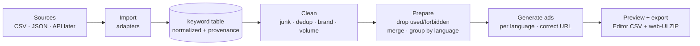

# Site.pro — Marketing Automation (Keyword → Google Ads)

> RU: перевод английского оригинала (README.md). При расхождении английская версия — источник правды.

Платформа в Docker на базе Yii2 + PostgreSQL, которая загружает данные по ключевым словам из нескольких источников (Google Ads, Search Console, органика Ahrefs и платные ключевые слова конкурентов), очищает их, готовит кампании Google Ads, сгруппированные по языку, и экспортирует их для **обоих** путей импорта в Google Ads — CSV для **Google Ads Editor** (десктоп) и ZIP для **массовой загрузки через веб-интерфейс**. Разработано с использованием AI-ассистированного кодинга (#vibecoding).

> **Статус:** в работе. См. `docs/WORKLOG.md` — что сделано и
> что дальше.
>
> **Живое демо:** https://sitepro.dm312sv.online

## Быстрый старт

```bash
cp .env.example .env               # config: admin login, DB, cookie key (works as-is for local)
docker compose up --build -d       # → http://127.0.0.1:8100

# load the four sample keyword files (or upload them in the admin area)
docker compose exec app php yii import/samples

# run the pipeline (or use the admin pages: Cleaning → Prepare → Ads)
docker compose exec app php yii clean/run        # junk · dedup · brand · volume
docker compose exec app php yii prepare/run      # drop used/forbidden · merge · group by language
docker compose exec app php yii adgen/run        # one responsive search ad per ad group
```

Учётные данные администратора берутся из `.env` (`ADMIN_USERNAME` / `ADMIN_PASSWORD`; по умолчанию `admin` / `admin`).
Войдите, затем **Import & data** → загрузите CSV/JSON, и **Keywords** → просматривайте всё
импортированное. Остановить — `docker compose down` (добавьте `-v` для сброса данных).

## Как это протестировать (для проверяющих)

Используйте **живое демо** (уже наполнено данными, настройка не нужна) или локальный запуск — процесс одинаков.
Всё, что задание просит протестировать — **загрузка, админ-раздел, предпросмотр, экспорт** — находится на этих страницах.

1. **Войдите** с учётными данными из `.env` (учётные данные живого демо предоставляются вместе с заявкой).
2. **Import & data** → **Clear all data** для чистого старта, затем загрузите каждый файл-источник из
   `sample-data/` (или его JSON-двойник в `sample-data/json/`),
   выбирая соответствующий **Source** каждый раз. → импортировано **378** ключевых слов.
   > Загрузка *добавляет* партию — она не заменяет данные. Для чистого повторного прогона сначала нажмите **Clear all data**
   > (иначе вы увидите задвоенные счётчики). Быстрая команда для всех четырёх сразу: `yii import/samples`.
3. **Cleaning** → **Run** — junk · dedup · brand · volume, с воронкой, объясняющей каждое отбрасывание. → оставлено **154**.
4. **Prepare** → **Run** — отбросить уже использованные/запрещённые · объединить · сгруппировать по языку + теме.
   → подготовлено **107** в **19** группах объявлений по **6** языкам.
5. **Ads** → **Run** — одно адаптивное поисковое объявление на группу объявлений, на её языке. → **19** объявлений.
6. **Export** → предпросмотр + две загрузки:
   - **Editor CSV** — один файл для десктопного приложения **Google Ads Editor** (Account → Import → From file). → **127** строк.
   - **Bulk-upload ZIP** — по одному CSV на сущность для **веб-интерфейса** (Tools → Bulk actions → Uploads); вложенный README указывает порядок.

Сквозная проверка чисел от начала до конца: **378 → 154 → 107 → 19 групп объявлений / 19 объявлений → Editor CSV 127 строк · bulk ZIP (4 листа)**.

## Что это делает



Конвейер (соответствует заданию):

1. **Import** источников ключевых слов — сейчас CSV / JSON, позже внешний API, за общим адаптером.
2. **Admin area** — видно каждое ключевое слово и каждую стадию конвейера.
3. **Clean** — удалить мусор, дедуплицировать, отбросить брендовые термины, отфильтровать по частоте поиска.
4. **Prepare for Google Ads** — отбросить уже использованные и запрещённые ключевые слова, объединить дубликаты,
   сгруппировать по языку.
5. **Generate ads & export** — адаптивные поисковые объявления на языке каждого ключевого слова, указывающие на
   правильный локализованный URL, плюс предпросмотр на экране и два артефакта импорта: CSV для Google Ads
   Editor (десктоп) и ZIP для массовой загрузки через веб-интерфейс (по одному листу на сущность).

Каждое ключевое слово несёт информацию о том, **почему** оно было отброшено, поэтому воронка в админ-разделе объясняет каждое решение,
а не является чёрным ящиком.

## Данные

Реальные поисковые метрики (месячная частота, CPC, конкуренция) берутся из **Google Ads Keyword
Planner**. Приватные, привязанные к аккаунту выгрузки, к которым у нас нет доступа (живой список ключевых слов Ads,
запросы Search Console, подписка Ahrefs), представлены **чётко помеченными
образцовыми файлами** с реалистичной структурой. Реальные данные и образцы всегда помечены — см.
`docs/DATA.md`.

## Стек

- **Yii2** basic 2.0.55, **PHP 8.4** — тонкие контроллеры, логика в сервисном слое
- **PostgreSQL 16**
- **Docker Compose** — `db` / `app` (php-fpm) / `web` (nginx), одна команда

## Структура проекта

```
backend/            Yii2 application (config, controllers, models, services, views, migrations)
docker/             nginx config
docker-compose.yml  full stack (web on 127.0.0.1:8100)
docs/               PLAN · DATA · API · WORKLOG · brief/TASK
```

## Документация

- `docs/PLAN.md` — архитектура, план и решения
- `docs/DATA.md` — источники данных, происхождение и унифицированная схема
- `docs/API.md` — контракты импорта / экспорта
- `docs/WORKLOG.md` — журнал работ и текущий статус
- `docs/brief/TASK.md` — исходное задание